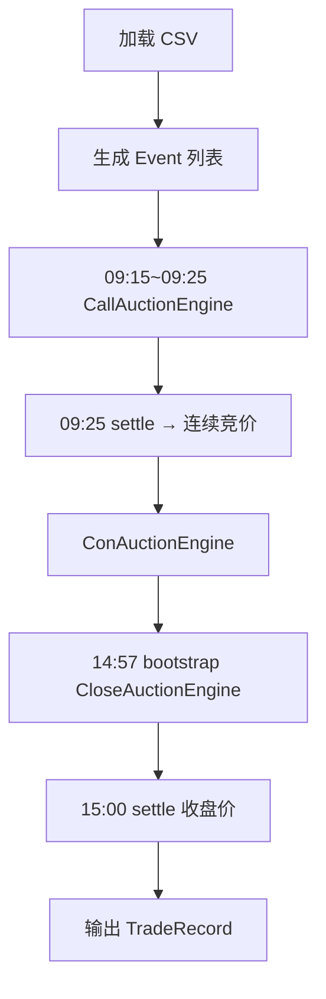

# 项目设计文档（Design README）

> 适用版本：`wangcai_orderbook_cpp` 当前 `master` 分支

## 1. 总览
本仓库实现了一个**撮合级**回测框架，覆盖 A 股两市（沪/深）完整竞价流程：

1. 开盘集合竞价（09:15–09:25）  
2. 连续竞价（09:30–11:30 / 13:00–14:57）  
3. 收盘集合竞价（14:57–15:00）

核心目标：
- 精确重现撮合逻辑（价格优先 / 时间优先 / 特殊指令）
- 提供高性能的订单簿实现，支持百万级订单
- 支持策略插件，方便用户自定义交易逻辑

## 2. 目录结构
```
include/
  orderbook.h            // 订单簿核心
  call_auction_engine.hpp// 开盘集合竞价
  con_auction_engine.hpp // 连续竞价
  close_auction_engine.hpp// 收盘集合竞价
  backtest_engine.hpp    // 回测驱动
  ...
src/
  orderbook.cpp
  call_auction_engine.cpp
  con_auction_engine.cpp
  close_auction_engine.cpp
  backtest_engine.cpp
  OrderLoader.cpp        // CSV→Event 解析
  backtest_main.cpp      // CLI 入口
```

## 3. 核心模块
| 模块 | 作用 | 关键接口 |
| ---- | ---- | -------- |
| `OrderPool` | 对象池，O(1) 申请/释放订单 | `acquire()` |
| `OrderBook` | 价位桶+链表维护挂单 & 最优价 | `createOrder` / `bestBid` |
| `CallAuctionEngine` | 09:25 撮合，深/沪分支 | `accept` / `cancel` / `settle` |
| `ConAuctionEngine` | 连续竞价撮合 | `accept` / `match_*` |
| `CloseAuctionEngine` | 14:57 之后撮合 | `bootstrap_from_orderbook` / `settle` |
| `BacktestEngine` | 驱动事件→引擎→策略，生成 MarketData/TradeRecord | `run()` |
| `Strategy`(接口) | 用户策略基类 | `onMarketData` 等 |
| `OrderLoader` | CSV→Event 解析工具 | `load_orders_from_csv` |

### 3.1 数据结构
1. **桶（Bucket）**  
   - 每个价格对应一个桶，内部用 `std::list<OrderPtr>` 维护时间顺序
   - `prev/next` 字段形成双链表，仅链接“非空桶”，`_best_bid/_best_ask` 指向链表头

2. **Fenwick 树**  
   - 在集合竞价阶段实时维护**买/卖量前缀和**，O(log N) 前缀查询

3. **映射表**  
   - `input2sys_ / sys2input_`：原始单号 ↔ 系统单号
   - `first_trade_px_`：深市市价单首笔成交价缓存

### 3.2 事件生命周期
```
CSV → Event → OrderLoader → OrderBook::whole_events (map<sort_key, vector<Event>>)
      ↘ BacktestEngine::run() 顺序遍历
          ↘ Call / Con / Close Engine  -> OrderBook 状态变更
              ↘ OrderBook 回调 → Execution → MarketData → Strategy
```

### 3.3 竞价算法
1. **深市开盘 / 收盘**  
   - 遍历全部价位，三层优先级：`max tradable vol` > `min surplus diff` > `closest to ref_px`  
   - `ref_px`=最新成交价(若存在) 否则昨收

2. **沪市集合竞价**  
   - 先筛选所有 `tradable` 价位
   - 选出最大成交量 + 最小剩余量差 → 得到候选集合
   - 取候选价位的**算术均价**，四舍五入到 100 (厘)

3. **连续竞价**  
   - 传统价格优先/时间优先撮合，区分市场：  
     - 上海：`SH` 支持排队撮合  
     - 深圳：`SZ` 处理市价→保护价替换逻辑

## 4. BacktestEngine 流程


## 5. 扩展性
- **策略**：实现 `Strategy` 接口即可接入
- **新市场**：新增 `MarketType` & 对应 `accept_* / match_*`
- **数据格式**：`OrderLoader` 可替换为任意解析器，只需生成 `Event`

## 6. 性能
- 对象池避免频繁 `new/delete`
- 桶+链表保证 O(1) 插/删 最优价更新
- Fenwick 树 O(log N) 前缀查询，集合竞价总体 O(N log N)

---
以上即为整体设计说明。若需更深入细节（锁粒度、异常安全等）请参考源码内的注释。 